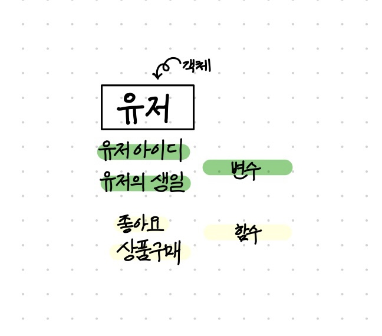

# 객체지향프로그래밍
: '객체'간의 상호작용을 중심으로 하는 프로그래밍

**객체**   
1) 객체의 ***상태***를 나타내는 ***'변수'***   
2) 객체의 ***행동***을 나타내는 ***'함수'***   
ex)    

즉, ***프로퍼티***와 ***메소드***로 이루어진 각 객체들의 ***상호작용***을 중심으로 코드를 작성하는 것을 말한다.   

## 절차 지향 프로그래밍
: 변수와 함수를 가지고 ***작업의 순서***에 맞게 코드를 작성하는 것.   

