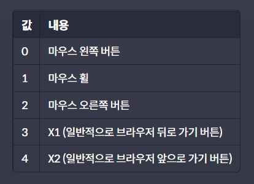

# 다양한 이벤트
## **1. MouseEvent.button**
마우스 이벤트 객체의 버튼 프로퍼티를 활용하면, 마우스 버튼을 눌렀을 때 일어난 이벤트에 대해서 어떤 버튼을 눌러서 일어난 이벤트인지를 정확하게 알아낼 수 있다.   

   

   

참고로 ```mouseenter, mouseleave, mouseover, mouseout, mousemove``` 처럼 마우스 이동과 관련된 이벤트에서는 이 값이 null이나 undefined가 아니라 0이다.   

## **2. MouseEvent.type**
   

## **3. MouseEvent.위치프로퍼티**
마우스 이벤트 객체에는 마우스 포인터의 위치와 관련된 다양한 프로퍼티들이 있다. 주로 아래와 같은 프로퍼티들이 자주 사용된다.   


## **3-1. client프로퍼티**
: 클라이언트 영역 내에서 마우스의 좌표 정보를 담는다.    
즉, 클라이언트 영역이란 **이벤트가 발생한 순간에 브라우저가 콘텐츠를 표시할 수 있는 영역** 이라고 한다.   
```client```값은 순간 보여지는 화면을 기준으로 계산.   
스크롤 위치와는 무관하게 항상 보여지는 화면의 좌측 상단의 모서리 위치를 (0,0)으로 계산한다.   

## **3-2. offset프로퍼티**
: 이벤트가 발생한 ```target```이 기준   
```offset```값도 이벤트가 발생한 대상을 기준으로 계산.    
스크롤 위치와는 무관하게 항상 보여지는 화면의 좌측 상단의 모서리 위치를 (0,0)으로 계산한다. 

## **3-3. page프로퍼티**
: 전체 문서를 기준으로 마우스 좌표 정보를 담고 있다.   
그렇기 때문에 스크롤로 인해서 보이지 않게 된 화면의 영역까지 포함해서 측정한다는 점이 앞의 두 프로퍼티의 차이점이다.   

## **4. MouseEvent.relatedTarget**
```mouseenter, mouseleave, mouseover, mouseout``` 이벤트에는 ```relatedTarget```이라는 프로퍼티가 존재한다.

```target``` 프로퍼티가 이벤트가 발생한 요소를 담고 있다면, ```relatedTarget``` 프로퍼티는 이벤트가 발생하기 직전(또는 직후)에 마우스가 위치해 있던 요소를 담고 있다.

비슷하지만 서로 다른 두 프로퍼티를 잘 구분해서 기억해 두면 좋다.   

## **5. KeyboardEvent.type**
키보드 이벤트의 타입에는 아래와 같은 타입들이 있습니다.    

   

## **6. KeyboardEvent.key vs KeyboardEvent.code**
```key```는 사용자가 누른 키가 가지고 있는 값을 나타내고,      ```code```는 누른 키의 물리적인 위치를 나타낸다.   

## **7. input태그 다루기**
```input``` 태그는 말 그대로 입력의 역할을 하는 태그이다. 타입에 따라 조금씩 차이가 있을 수 있지만, ```input``` 태그를 다룰 때는 아래와 같은 이벤트 타입들이 활용될 수 있다.   

   


## **8. 스크롤 이벤트**
```scroll``` 이벤트는 보통 ```window``` 객체에 이벤트 핸들러를 등록하고 ```window``` 객체의 프로퍼티와 함께 자주 활용된다.

특히 ```scrollY``` 프로퍼티를 활용하면 스크롤된 특정한 위치를 기준으로 이벤트 핸들러가 동작하게 하거나 혹은 스크롤 방향(위로 스크롤 중인지/아래로 스크롤 중인지)을 기준으로 이벤트 핸들러가 동작하게끔 활용할 수도 있다.   
예를 들어,
```javascript
//scroll 이벤트
let lastScrollY = 0;

function printEvent(e) {
  const STANDARD = 30;

  const nav = document.querySelector('#nav');
  const toTop = document.querySelector('#to-top');

  if(window.scrollY > STANDARD) { //스크롤이 30px을 넘었을 때
    nav.classList.add('shadow');
    toTop.classList.add('show');
  } else { //스크롤이 30px을 넘지 않을 때
    nav.classList.remove('shadow');
    toTop.classList.remove('show');
  }

  if (window.scrollY > lastScrollY) { //스크롤 방향이 아랫쪽 일 때
    nav.classList.add('lift-up');
  } else { // 스크롤 방향이 윗쪽일 때
    nav.classList.remove('lift-up');
  }

  lastScrollY = window.scrollY;
}

window.addEventListener('scroll', printEvent);
```

