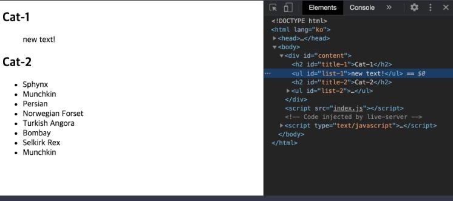

## **1. window 객체**
```window``` 객체는 브라우저 창을 대변하면서 자바스크립트에서 최상단에 존재하는 객체이다.   
자바스크립트 코드 어느 곳에서나 항상 접근할 수 있는 객체이기 때문에 전역 객체, 영어로는 Global Object이다.  
어떤 프로퍼티나 메소드를 사용하든 결국 전역 객체 내부의 것이기 때문에 앞에 window.을 생략할 수도 있다.

## **2. DOM**
**DOM**이란 Document Object Model의 약자로, 한국어로는 ```문서 객체 모델```이다.   
간단하게 표현하면 웹 페이지에 나타나는 HTML 문서 전체를 ***객체***로 표현한 것으로 생각하면 된다.   
이때 ```각 객체를 노드(Node)라는 용어로 표현하고, 태그는 요소 노드, 문자는 텍스트 노드```로 구분된다.   

## **3. DOM 트리**
HTML의 계층 구조는 DOM에서도 반영되는데 이러한 계층구조를 나무에 비유해서 DOM 트리라고 부른다.   
각 노드 간의 관계는 부모, 자식, 형제라는 용어로 표현한다.  
그림 참고하자. 


## **4. DOM 이동 시 활용 가능한 프로퍼티**


## **5. 주요 요소 노드 프로퍼티**


## **5-1. inner/outerHTML, textContent 비교**
* html
```html
<!DOCTYPE html>
<html lang="ko">
<head>
  <meta charset="UTF-8">
  <title>JS with Codeit</title>
</head>
<body>
  <div id="content">
    <h2 id="title-1">Cat-1</h1>
    <ul id="list-1">
      <li>Ragdoll</li>
      <li>British Shorthair</li>
      <li>Scottish Fold</li>
      <li>Bengal</li>
      <li>Siamese</li>
      <li>Maine Coon</li>
      <li>American Shorthair</li>
      <li>Russian Blue</li>
    </ul>
    <h2 id="title-2">Cat-2</h1>
    <ul id="list-2">
      <li>Sphynx</li>
      <li>Munchkin</li>
      <li>Persian</li>
      <li>Norwegian Forset</li>
      <li>Turkish Angora</li>
      <li>Bombay</li>
      <li>Selkirk Rex</li>
      <li>Munchkin</li>
    </ul>
  </div>
  <script src="index.js"></script>
</body>
</html>
```

## ***element.innerHTML***
* 요소 노드 내부의 HTML 코드를 문자열로 리턴. (내부에 있는 줄 바꿈이나 들여쓰기 모두 포함)

```javascript
const myTag = document.querySelector('#list-1');

// innerHTML
console.log(myTag.innerHTML);
```
   

* 요소 안의 정보를 확인할 수도 있지만, 내부의 HTML 자체를 수정할 때 좀 더 자주 활용된다. (내부에 있던 값을 완전히 새로운 값으로 교체하기 때문에 주의해서 사용해야한다!)   

```javascript
const myTag = document.querySelector('#list-1');

// innerHTML
console.log(myTag.innerHTML);
myTag.innerHTML = '<li>Exotic</li>';
console.log(myTag.innerHTML);
```

   

## ***element.outerHTML***
* 요소 노드 자체의 전체적인 HTML 코드를 문자열로 리턴해준다. (내부에 있는 줄 바꿈이나 들여쓰기 모두 포함.)
```javascript
const myTag = document.querySelector('#list-1');

// outerHTML
console.log(myTag.outerHTML);
```
   

* ```outerHTML```은 새로운 값을 할당할 경우 요소 자체가 교체되어 버리기 때문에 주의해야 합니다.
```javascript
const myTag = document.querySelector('#list-1');

// outerHTML
console.log(myTag.outerHTML);
myTag.outerHTML = '<ul id="new-list"><li>Exotic</li></ul>';
```
   

## ***element.textContent***
* 요소 안의 내용들 중에서 HTML 태그 부분은 제외하고 텍스트만 가져옴. (내부에 있는 줄 바꿈이나 들여쓰기 모두 포함.)   
```javascript
const myTag = document.querySelector('#list-1');

// textContext
console.log(myTag.textContent);
```
   

* 새로운 값을 할당하면 innerHTML과 마찬가지로 내부의 값을 완전히 새로운 값으로 교체한다.
```javascript
const myTag = document.querySelector('#list-1');

// textContext
console.log(myTag.textContent);
myTag.textContent = 'new text!';
```
   

* 하지만 ```textContent```는 말그대로 텍스트만 다루기 때문에, 특수문자도 텍스트로 처리한다.   
```javascript
const myTag = document.querySelector('#list-1');

// textContext
console.log(myTag.textContent);
myTag.textContent = '<li>new text!</li>';
```
   

## **6. 요소 노드 다루기**
1. 요소 노드 만들기: ```document.createElement('태그이름')```
2. 요소 노드 꾸미기: ```element.textContent, element.innerHTML, ...```
3. 요소 노드 추가 혹은 이동하기: ```element.prepend, element.append, element.after, element.before```
4. 요소 노드 삭제하기: ```element.remove()```   

예를 들어 코드로 확인하자.
* html
```html
<!DOCTYPE html>
<html lang="ko">
<head>
  <meta charset="UTF-8">
  <title>JS with Codeit</title>
</head>
<body>
  <div>
    <h1>오늘 할 일</h1>
		<ol id="today">
			<li>자바스크립트 공부</li>
			<li>고양이 화장실 청소</li>
			<li>고양이 장난감 쇼핑</li>
		</ol>
		<h1>내일 할 일</h1>
		<ol id="tomorrow">
			<li>자바스크립트 공부</li>
			<li>뮤지컬 공연 예매</li>
			<li>유튜브 시청</li>
		</ol>
  </div>
  <script src="index.js"></script>
</body>
</html>
```

* javascript
```javascript
const today = document.querySelector('#today');

today.innerHTML = '<li>처음</li>' + today.innerHTML;
today.innerHTML = today.innerHTML + '<li>마지막</li>';

today.outerHTML = '<p>이전</p>' + today.outerHTML; 

const newToday = document.querySelector('#today');
newToday.outerHTML = newToday.outerHTML + '<p>다음</p>';

// 요소 노드 추가하기
const tomorrow = document.querySelector('#tomorrow');

// 1. 요소 노드 만들기: document.createElement('태그이름')
const first = document.createElement('li');

// 2. 요소 노드 꾸미기: textContent, innerHTML, ...
first.textContent = '처음';

// 3. 요소 노드 추가하기: NODE.prepend, append, after, before
tomorrow.prepend(first);

const last = document.createElement('li');
last.textContent = '마지막';
tomorrow.append(last);

const prev = document.createElement('p');
prev.textContent = '이전';
tomorrow.before(prev);

const next = document.createElement('p');
next.textContent = '다음';
tomorrow.after(next);
```

* javascript
```javascript
// 노드 삭제와 이동
const today = document.querySelector('#today');
const tomorrow = document.querySelector('#tomorrow');

// 노드 삭제하기: Node.remove()
tomorrow.remove();
today.children[2].remove();

// 노드 이동하기: prepend, append, before, after
today.append(tomorrow.children[1]);
tomorrow.children[1].after(today.children[1]);
tomorrow.children[2].before(today.children[1]);
tomorrow.lastElementChild.before(today.children[1]);
```

## **7. HTML 속성 다루기**
대부분의 HTML 속성은 DOM 객체의 프로퍼티로 변환이 된다.
하지만, 표준 속성이 아닌 경우에는 프로퍼티로 변환이 안된다.   
아래 메소드를 활용하면 표준이 아닌 HTML 속성들도 다룰 수 있다.

1. 속성에 접근하기: ```element.getAttribute('속성')```
2. 속성 추가(수정)하기: ```element.setAttribute('속성', '값')```
3. 속성 제거하기: ```element.removeAttribute('속성')```   


* html
```html
<!DOCTYPE html>
<html lang="ko">
<head>
  <meta charset="UTF-8">
  <title>JS with Codeit</title>
</head>
<body>
  <div>
    <h1>오늘 할 일</h1>
		<ol id="today">
      <li class="item">자바스크립트 공부</li>
			<li class="item">고양이 화장실 청소</li>
			<li class="item">고양이 장난감 쇼핑</li>
		</ol>
		<h1>내일 할 일</h1>
    <ol id="tomorrow" href="https://www.codeit.kr">
      <li class="item"><a href="https://developer.mozilla.org/ko/docs/Web/JavaScript">자바스크립트 공부</a></li>
			<li class="item">뮤지컬 공연 예매</li>
			<li class="item">유튜브 시청</li>
		</ol>
  </div>
  <script src="index.js"></script>
</body>
</html>
```
* javascript
```javascript
// HTML 속성 (HTML attribute)
const tomorrow = document.querySelector('#tomorrow');
const item = tomorrow.firstElementChild;
const link = item.firstElementChild;

// elem.getAttribute('속성'): 속성에 접근하기
console.log(tomorrow.getAttribute('href'));
console.log(item.getAttribute('class'));

// elem.setAttribute('속성', '값'): 속성 추가(수정)하기
tomorrow.setAttribute('class', 'list'); // 추가
link.setAttribute('href', 'https://www.codeit.kr'); // 수정

// elem.removeAttribute('속성'): 속성 제거하기
tomorrow.removeAttribute('href'); 
tomorrow.removeAttribute('class'); 

// id 속성
console.log(tomorrow);
console.log(tomorrow.id);

// class 속성
console.log(item);
console.log(item.className);

// href 속성
console.log(link);
console.log(link.href);
console.log(tomorrow.href);
```

## **8. 스타일 다루기**
자바스크립트로 태그의 스타일을 다루는 방법에는 크게 두 가지가 있다.

1. style 프로퍼티 활용하기: ```element.style.styleName = 'value';```
2. class 변경을 통해 간접적으로 스타일 적용하기: ```element.className, element.classList```   
## **8-1. classList의 유용한 메소드**
   

* html
```html
<!DOCTYPE html>
<html lang="ko">
<head>
  <meta charset="UTF-8">
	<link rel="stylesheet" href="style.css">
  <title>JS with Codeit</title>
</head>
<body>
  <div>
    <h1 class="title">오늘 할 일</h1>
		<ol id="today" class="list today">
			<li class="item">자바스크립트 공부</li>
			<li class="item">고양이 화장실 청소</li>
			<li class="item">고양이 장난감 쇼핑</li>
		</ol>
		<h1 class="title">내일 할 일</h1>
		<ol id="tomorrow" class="list tomorrow">
			<li class="item">자바스크립트 공부</li>
			<li class="item">뮤지컬 공연 예매</li>
			<li class="item">유튜브 시청</li>
		</ol>
  </div>
  <script src="index.js"></script>
</body>
</html>
```

* css
```css
.done {
  opacity: 0.5;
  text-decoration: line-through;
}
```

* javsscript
```javascript
// 스타일 다루기
const today = document.querySelector('#today');
const tomorrow = document.querySelector('#tomorrow');

// elem.classList: add, remove, toggle
const item = tomorrow.children[1];
item.classList.add('done');
item.classList.remove('done');
item.classList.toggle('done');

// elem.className
today.children[1].className = 'done';

// style 프로퍼티
today.children[0].style.textDecoration = 'line-through';
today.children[0].style.backgroundColor = '#DDDDDD';
today.children[2].style.textDecoration = 'line-through';
today.children[2].style.backgroundColor = '#DDDDDD';
```  
