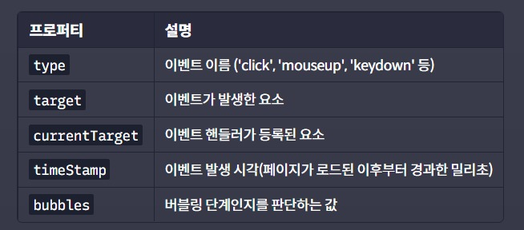
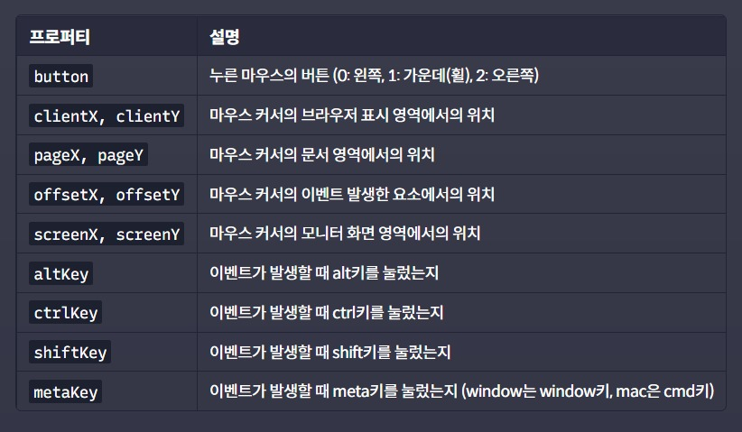
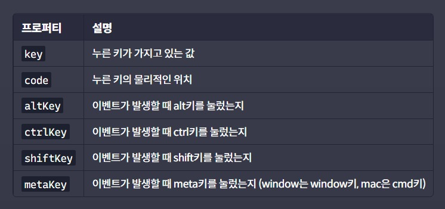

# **이벤트 객체 프로퍼티**
## **1. 공통 프로퍼티**
아래 프로퍼티들은 이벤트 타입과 상관없이 모든 이벤트 객체들이 공통적으로 가지고 있는 프로퍼티이다.   

## **2. 마우스 이벤트**
마우스와 관련된 이벤트의 경우에는 아래와 같은 이벤트 객체의 프로퍼티들을 가지고 있다.   

## **3. 키보드 이벤트**
키보드와 관련된 이벤트의 경우에는 아래와 같은 이벤트 객체의 프로퍼티들을 가지고 있다.   
   

이 프로퍼티들은 자주 사용되는 프로퍼티일 뿐 이벤트 객체의 모든 프로퍼티가 아니다.

