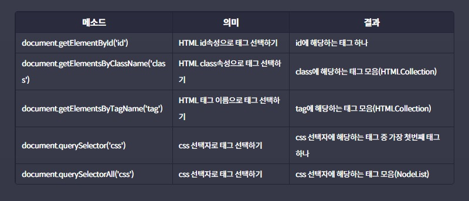

# **인터랙티브 자바스크립트**
## **1. 자바스크립트로 태그 선택하기**
    

위 표 참고해서 코드로 보면 (주의할점은 대문자 소문자 구별잘해야한다.)

```javascript
//id로 태그 선택하기
document.getElementById('id');

//class로 태그 선택하기
document.getElementsByClassName('class');

//css선택자로 태그 선택하기
document.querySelector('css');

//css선택자로 태그가 여러개일경우, 선택하기
document.querySelectorAll('css');

```

## **2. 유사 배열이란?**
* 배열과 유사한 객체 ex) HTMLCollection, NodeList, DOMTokenList, ...     

**특징**  
* 숫자 형태의 indexing이 가능하다.
* length 프로퍼티가 있다.
* 배열의 기본 메소드를 사용할 수 없다.
* Array.isArray(유사배열)의 리턴값은 false다.   

## **3. 이벤트와 이벤트 핸들링, 그리고 이벤트 핸들러**
***이벤트*** : 웹 페이지에서 발생하는 대부분의 일(사건)들
  ex) 버튼 클릭, 스크롤, 키보드 입력, ...    
  
***이벤트 핸들링*** : 자바스크립트를 통해 이벤트를 다루는 일

***이벤트 핸들러*** : 이벤트가 발생했을 때 일어나야하는 구체적인 동작들을 표현한 코드. 이벤트 리스너(Event Listener)라고도 부른다.

## **4. 이벤트 핸들러를 등록하는 2가지 방법**
### **4-1. 자바스크립트로 해당 DOM 객체의 onclick 프로퍼티에 등록하기** 
```javascript
// 이벤트(Event)와 버튼 클릭
const btn = document.querySelector('#myBtn');

// 이벤트 핸들링(Event Handling)
btn.onclick = function() { //이벤트 핸들러(Event Handler)
  console.log('Hello Codeit!');
};
```   
### **4-2. HTML 태그의 onclick 속성에 바로 표시하기**
```javascript
<button id="myBtn" onclick="console.log('Hello Codeit!')">클릭!</button>
```
주로 4-1 방법으로 쓰인다.